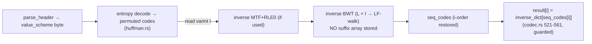

# DESIGN — Cubrim BWT pre-pass on the value-code stream (CUBR-0020, AC-1)

> Internal design artefact. Algorithm disclosure is permitted (operator decision 2026-06-18).
> This is a **research/design round only**. No Rust, no benchmark. The cheap entropy-gate
> (AC-2) and any Rust implementation (AC-3/4) are separate downstream stages, dispatched
> only if the gate says GO — mirroring the CUBR-0018 / CUBR-0019 discipline.

## 0. Problem statement

T4 (order-1 context-adaptive canonical Huffman, `ValueScheme::EntropyContext`) is the
current best value-stream coder, aggregate ratio **0.489444** on the fixed 7-file corpus
(baseline, `main @ 794148d`). Two cheap entropy probes proved that any *i-order-preserving*
reordering of the value stream is inert:

- **CUBR-0018** (axis-sort): NO-GO. Sorting `seq_codes` by a φ-coordinate *destroys* the
  i-order runs T4 exploits — conditional entropy worsened on every clustered file, best gain
  +0.1 % on `dense`. Root cause: corpus locality lives in i-space, not φ-coordinate space.
- **CUBR-0019** (N-dim sweep): NO-GO, and structurally inevitable. `seq_codes` is built by
  `idx_to_code[phi_inv(coords, b)] = v2c[val]` then read linearly; since
  `phi_inv(phi(i, b, N), b) == i` for every valid N, the read-back is **always i-order**
  regardless of N. H(X_t|X_{t-1}) is byte-exact identical across N=2..6 (0.0000 % variation).

The common lever both probes lack is a **non-i-order serialization** of the value stream.
BWT (Burrows-Wheeler Transform) is exactly that: it is a reversible permutation that builds
its *own* locality by grouping symbols that share a forward context, producing a stream T4
has never seen. It does **not** sort by φ (Gotcha #3/#5 explicitly do not apply — they police
coordinate-sorting, which kills runs; BWT manufactures runs). This is the single remaining
structural idea for moving T4.

The exact insertion point in the real pipeline is unambiguous. In `codec.rs`
`encode_with_config`, lines 247-262 build `seq_codes: Vec<usize>` (one code per original
position i, i-order). Every value scheme consumes that vector:
`Entropy`/`EntropyContext`/`RleCodes` all read `seq_codes` directly; `BitpackFixed` reads the
lex-ordered `point_values`. A BWT pre-pass is a transform **on `seq_codes`** placed between
its construction (line 262) and its consumption by the entropy stage (line 293+). On decode,
the inverse BWT runs after the entropy stage reconstructs the permuted code vector and before
`result[i] = inverse_dict[seq_codes[i]]` (codec.rs lines 521-533 / 547-561).

---

## Component 1 — Reversibility scheme (the absolute invariant)

### 1.1 What inverse BWT actually requires (correcting the CUBR-0017 claim)

**The CUBR-0017 research note (line 229) is wrong** where it states BWT adds
"~n·log(n)/8 bytes of suffix-array overhead for the inverse permutation." That figure is the
cost of *storing* a suffix array, which the inverse does **not** need. This is the most
important correctness point in this design, so it is stated precisely:

Forward BWT of a length-n block produces:
1. the **last column** `L` — a permutation of the input symbols (this *is* the BWT output that
   gets entropy-coded), and
2. a single integer, the **primary index** `I` ∈ [0, n) — the row, in the sorted rotation
   matrix, that equals the original (un-rotated) string.

Inverse BWT reconstructs the original from **`L` and `I` alone**. The mechanism is the
LF-mapping (last-to-first): the first column `F` is just `L` sorted (a stable counting-sort by
symbol, O(n) with a small-alphabet histogram); the permutation linking each row of `L` back to
its predecessor row is derived from `F` and `L` by rank within symbol. Walking that permutation
`n` times starting at row `I` regenerates the original sequence. **No suffix array, no
O(n log n) permutation table, is ever stored or transmitted.**

Concretely, the bogus claim would size the overhead at, for a 65536-symbol block,
`65536 · log2(65536) / 8 = 65536 · 16 / 8 = 131072 bytes` — *larger than the entire input
block*. That would make BWT provably ratio-negative on every corpus file and the whole task an
instant NO-GO. The real overhead is one varint per block (see 1.3). The corrected accounting is
what makes the idea viable at all.

### 1.2 EOF-sentinel vs primary-index variant

Two textbook ways to make BWT invertible:

- **(A) Sentinel `$`**: append a unique end-of-block symbol smaller than every other symbol;
  the sorted-rotations matrix then has a unique first row and no primary index is needed. Cost:
  the alphabet grows by one symbol (the sentinel), which for Cubrim means a code value
  `n_distinct` that must round-trip through the n_distinct/inverse_dict machinery and the
  Huffman alphabet — invasive, because `inverse_dict` maps codes→bytes and there is no spare
  byte to represent `$`. Rejected: it perturbs the existing header contract.
- **(B) Primary index `I`**: no sentinel; store one integer per block. The alphabet is
  unchanged (still the existing `n_distinct` codes). This is the bzip2 lineage and the right
  fit for Cubrim because it touches nothing in the value-dictionary / inverse_dict path — the
  BWT operates purely on `seq_codes` symbol values already in `[0, n_distinct)`.

**Decision: variant (B), primary index.** The forward transform sorts the n rotations of the
length-n `seq_codes` block; `L[k]` = last symbol of the k-th sorted rotation; `I` = the index k
whose rotation is the identity rotation (original order). Decode: counting-sort `L`→`F`, build
the LF permutation, walk n steps from `I`.

### 1.3 Actual header overhead

Per block: **one primary index, stored as a varint (LEB128) — 1 to 3 bytes** for n ≤ 65536
(values < 128 → 1 byte; < 16384 → 2 bytes; ≤ 65536 → 3 bytes). With whole-stream single-block
granularity (Component 2), that is **2-3 bytes for the entire file**. This is the entire
reversibility overhead. It is negligible against any plausible entropy saving and cannot, by
itself, flip a GO to NO-GO. (Contrast the corrected 131 KB phantom from the n·log n claim.)

The index rides in the value-stream payload, not the fixed header: a new value-scheme byte
(see Component 3.4) signals "BWT was applied," and the BWT-coded payload is laid out as
`[primary_index : varint] [existing entropy-coded stream of L]`. The existing 13-byte fixed
header and the cube/gap header are untouched; `count`/`L`/`n_distinct`/`inverse_dict` keep
their current meaning because BWT permutes codes, never changes the multiset of codes or the
dictionary.

---

## Component 2 — Block size

### Options

1. **Whole value stream as one block** (n = `count` = number of populated cells, ≤ L ≤ 65536).
2. **Fixed window** (e.g. 16 KiB blocks à la bzip2's 100-900 KB selectable blocks).
3. **Per-cube / per-axis block** (align BWT blocks to cube structure).

### Analysis

The corpus blocks are **≤ 65536 symbols** (cube mode only fires for
`HEADER_OVERHEAD_BOUND=320 < L ≤ cube_size_limit`, and N grows past 65536 anyway). At that
scale the entire stream is small enough that a single BWT block is both feasible and optimal:

- BWT's grouping power **increases** with block length (more rotations to find shared
  contexts); fragmenting into windows strictly weakens it and multiplies the per-block primary
  index + any per-block Huffman/MTF table overhead. bzip2 uses large blocks for exactly this
  reason (research §2.5).
- Per-cube/per-axis blocking (option 3) re-introduces the φ-coordinate structure that CUBR-0018
  proved harmful, and adds bookkeeping for no entropy benefit. Rejected.
- Suffix-array construction on n ≤ 65536 is trivially cheap. Naive O(n² log n) rotation sort is
  ~4 billion comparisons worst case at n=65536 — too slow for production but fine for the
  **Python AC-2 probe** (which can use Python's built-in suffix-array-free approaches or a
  simple SA-IS). For the eventual Rust impl, **SA-IS** (Nong-Zhang-Chan, linear time) or DC3 is
  the production-grade choice; for the small alphabet (n_distinct ≤ 256) SA-IS with a
  bucket-sort induced-sorting pass is straightforward and O(n). The probe does not need SA-IS —
  correctness over speed there.

**Decision: single whole-stream block** (n = `count`). Memory is O(n) integers (≤ 256 K for
the suffix array at n=65536), construction is one-shot. No windowing, no per-cube alignment.
Rationale: maximises BWT grouping, minimises overhead to a single varint, matches corpus scale.
If a future corpus exceeds 65536 the input is already on the raw-store / higher-N path and BWT
is out of scope there.

---

## Component 3 — Pipeline between BWT and T4

### The question

bzip2's canonical pipeline is **BWT → MTF → RLE0 → Huffman**. T4 is *order-1* context Huffman.
BWT output is famously well-suited to **MTF + order-0** coding. So three candidate pipelines:

1. **BWT → order-1 T4 directly** (reuse `EntropyContext` on the permuted stream).
2. **BWT → MTF → RLE0 → order-0 Huffman** (`Entropy` / `ValueScheme::Entropy`, the bzip2 path).
3. **BWT → MTF → order-1 T4** (MTF then context Huffman).

### Analysis (the order-1-on-BWT double-counting trap)

This is the subtle architectural call. **Order-1 Huffman applied directly to BWT output tends
to double-count the structure BWT already exposes.** BWT's whole purpose is to convert
*context* correlation (P(symbol | preceding context)) into *positional* correlation — long runs
of identical symbols. After BWT the right model is "I am probably the same symbol as my
neighbour," which is exactly what **MTF** captures (mapping a run of symbol s to a run of
zeros) and what **order-0** entropy coding of the MTF output then compresses cheaply. Feeding
BWT output to an *order-1* coder asks the coder to learn "symbol s tends to be followed by
symbol s" — relearning, in a less efficient representation, the run structure MTF would have
collapsed to near-zero entropy. The literature (bzip2 lineage, research §2.5) is unambiguous
that MTF + order-0 is the matched follow-up; order-1 directly on BWT typically gains little over
order-0 and can lose to MTF+order-0 because the BWT runs inflate the order-1 context tables.

However, Cubrim has two coders already wired and byte-exact: `Entropy` (order-0 canonical
Huffman) and `EntropyContext` (order-1). It has **no MTF and no RLE0** yet.

### Decision

**Primary design target: BWT → MTF → RLE0 → order-0 `Entropy` (T3).** This is the matched
bzip2 pipeline and the configuration most likely to win. Rationale:
- MTF converts BWT runs into runs of zero; RLE0 collapses zero-runs to a length code; order-0
  Huffman then sees a low-entropy, heavily-skewed symbol distribution — the classic ~2 bpb
  regime.
- It reuses the existing `Entropy` order-0 coder (no new Huffman code), so the only genuinely
  new Rust code (in the eventual impl) is the BWT, MTF, and RLE0 transforms — each small,
  single-purpose, and independently round-trip-testable.

**The AC-2 probe MUST measure both** "BWT → order-1 (T4 proxy)" and "BWT → MTF → order-0
(T3 proxy)" against the i-order baseline (Component 4), precisely because order-1-on-BWT is
suspected to double-count. The probe is what decides; this design states the *hypothesis* (MTF
path wins) and the *fallback* (if MTF+order-0 underperforms but BWT+order-1 helps, the impl
keeps the existing T4 coder and skips MTF/RLE0 — fewer new transforms). The selector (R2, see
Component 6) picks the smaller of {baseline T4, BWT path} per file regardless, so non-regression
is preserved either way.

MTF/RLE0 are each ≤ 50 LoC single-file transforms with no contract change to the header — they
are noted here as impl-stage work, not pre-implemented (per the autonomous-mode inline-gap rule:
recorded, not done).

---

## Component 4 — AC-2 cheap-gate spec (the go/no-go probe)

### 4.1 Harness reuse

AC-2 reuses the **exact infrastructure** of `code/bench/entropy_traversal_probe.py`:
`build_value_codes(data)` (byte-exact to `seq_codes`), `cond_entropy_h1(seq, n_distinct)`
(empirical order-1 conditional entropy with sentinel-0 context), the manifest-driven
`process_file` loop, and the `verdict(rows, threshold)` GO/NO-GO renderer. The new probe is a
sibling file `code/bench/entropy_bwt_probe.py` that imports/copies those two helpers verbatim
(keeping byte-exact fidelity to T4's `seq_codes`) and adds:

- `bwt_forward(seq) -> (bwt_seq, primary_index)` — naive rotation sort (correctness over speed;
  n ≤ 65536 is fine in Python for a one-shot probe), returning the last-column code sequence.
- `mtf_encode(seq, n_distinct) -> mtf_seq` — move-to-front over the code alphabet.
- (RLE0 is **not** needed for the entropy measurement — RLE0 changes *size*, not the order-0
  symbol distribution's entropy in the way the probe measures; the probe measures entropy of the
  symbol stream, and the GO decision is about whether BWT exposes lower entropy. RLE0 is a pure
  size win on top and is left to the impl. The probe documents this explicitly.)

### 4.2 What the probe computes, per corpus file

For each of the 7 corpus files, build `seq_iorder = build_value_codes(data)` and compute:

| Column | Definition | Coder it proxies |
|--------|-----------|------------------|
| `H1_iorder` | `cond_entropy_h1(seq_iorder)` | current T4 baseline (order-1, i-order) |
| `H1_bwt` | `cond_entropy_h1(bwt_forward(seq_iorder)[0])` | BWT → order-1 (double-count test) |
| `H0_bwt_mtf` | `H0(mtf_encode(bwt_forward(seq_iorder)[0]))` | BWT → MTF → order-0 (bzip2 path) |
| `H0_iorder` | `H0(seq_iorder)` | reference order-0 (sanity) |

where `H0(seq)` is order-0 Shannon entropy of the symbol distribution (add a 3-line helper;
`scipy.stats.entropy` on the value histogram in base 2, or a numpy one-liner). Relative
reductions are computed against the i-order baseline that matches the *current* coder:
- `rel_bwt_h1   = (H1_iorder - H1_bwt)   / H1_iorder`
- `rel_bwt_mtf  = (H1_iorder - H0_bwt_mtf) / H1_iorder`

The MTF path is compared against `H1_iorder` (not `H0_iorder`) because the incumbent we must
beat is **T4 = order-1 i-order**, whose per-symbol cost is ≈ `H1_iorder`. That is the honest
bar: BWT+MTF+order-0 must undercut what order-1-on-i-order already achieves.

### 4.3 GO/NO-GO criterion (exact)

Mirror the CUBR-0018 `verdict()` contract with threshold **5 % relative** (same as the
established probes — the task says "noticeable entropy drop vs i-order on ≥1 file"; 5 % is the
codified "noticeable" threshold used by both prior probes, keeping the gate calibrated to
precedent):

> **GO** iff `max over the 7 files of max(rel_bwt_h1, rel_bwt_mtf) ≥ 0.05`.
> The winning column (`bwt_h1` or `bwt_mtf`) names which pipeline to implement.
> Otherwise **NO-GO** — a valid research outcome; AC-3/AC-4 are skipped, finding recorded as a
> third entry in the CUBR-0018/0019 NO-GO lineage.

The probe emits the same markdown layout as CUBR-0018 (results table + Decision Checkpoint +
the standard **proxy caveat**: conditional/marginal entropy is a *proxy* for real coded size;
a reduction is necessary but not sufficient — the Rust bench is ground truth; the gate only
avoids writing Rust against an unmeasured win). It records Python/NumPy versions and the
corpus manifest SHA-256 for reproducibility, exactly as the existing probes do.

### 4.4 Probe edge cases to encode

- **Length-1 / empty corpus entries**: `cond_entropy_h1` already returns 0.0 for len < 2;
  `bwt_forward` must handle n ≤ 1 (identity, primary_index = 0). The corpus min is
  `sparse_small` (L=256), so this is defensive only.
- **Fidelity assertion**: the probe re-asserts `seq_iorder` equals the CUBR-0018 reference
  (same `build_value_codes`), so the BWT input is provably the real T4 stream.

---

## Component 5 — Round-trip risk register

Round-trip byte-exactness is the **absolute invariant** (task Constraint #1). Every concrete way
inverse BWT can lose bytes, and the design defence:

| # | Failure mode | Why it loses bytes | Design defence |
|---|--------------|--------------------|----------------|
| R1 | **Primary-index off-by-one** | The LF-walk starts at the wrong row → entire output is a rotation of the original. | Define `I` precisely as "row whose sorted rotation is the identity (zero-shift) rotation," fix it in both forward and inverse, and pin it with a property test: `inverse(forward(x)) == x` for randomized x including adversarial periodic inputs. The differential oracle (AC-3) compares against a Python twin computing `I` identically. |
| R2 | **Primary-index serialization width** | Truncating `I` to u16 fails for n > 65535; misreading varint length corrupts the following bitstream offset. | Varint (LEB128) with an explicit decode that returns bytes-consumed, so the entropy-stream offset is exact. n is bounded ≤ 65536 (cube-mode ceiling) but the varint is width-agnostic and asserted `I < n` on decode (fail-closed `CubrimError::Decode`). |
| R3 | **Empty / length-1 block** | BWT of n≤1 is degenerate; a naive sort or LF-walk may panic or emit nothing. | Explicit guard: n=0 → empty output, I=0; n=1 → output = input, I=0. Unit-tested. Note the *cube* path only runs for L>320, but `count` (populated cells) could in principle be tiny; guard regardless. |
| R4 | **EOF-sentinel confusion** | If a sentinel were used (variant A), an input that already contains the sentinel symbol corrupts decode. | **Avoided by design** — variant (B) uses a primary index, no sentinel, so no in-band reserved symbol exists. This whole class is eliminated. |
| R5 | **Alphabet / stable-sort instability** | If the counting-sort `L→F` is not stable, or rank-within-symbol differs between forward and inverse, the LF permutation is wrong → silent corruption. | Specify a **stable** counting sort keyed on `(symbol, original_rank)` and identical rank computation on both sides; Python twin and Rust use the same deterministic tie-break. Property test with high-multiplicity alphabets (e.g. 2-symbol input, all-same input). |
| R6 | **MTF/RLE0 inverse mismatch** (if MTF path chosen) | MTF table must be re-initialised identically; RLE0 zero-run length coding must round-trip exactly, including a run that fills the block. | MTF init = identity permutation of `[0, n_distinct)`; RLE0 uses an unambiguous bijective length code; both get standalone `inverse(forward(x)) == x` property tests *before* wiring into the codec. These transforms are tested in isolation, not only end-to-end. |
| R7 | **Code value ≥ n_distinct after inverse** | A decode bug could emit a code outside the dictionary → out-of-bounds `inverse_dict[code]`. | The existing decode already guards `code >= n_distinct → CubrimError::Decode` (codec.rs 522-526 / 550-556). BWT inverse output feeds that same guarded path, so the invariant is inherited. |
| R8 | **Selector picks BWT but writes wrong scheme byte** | If `estimate_*_size` and the actual encode disagree on whether BWT was applied, decode dispatches the wrong inverse. | Single source of truth: the chosen scheme byte is written to the header and decode dispatches *solely* on it (mirrors the existing `ValueScheme::from_byte` dispatch). Encode-time size estimate and actual encode call the same transform function. |

The cornerstone test (AC-4) is a **strict byte-exact lossless round-trip on all 7 corpus files
plus the existing edge fixtures** (empty, 1-byte, all-same, all-256-distinct), with a
differential oracle against a Python BWT twin. Any single losing byte is a blocking bug, not a
trade-off (Cubrim Convention: "a compressor that loses data is a bug").

---

## Component 6 — Go/no-go recommendation framing

**The next stage is the cheap entropy gate (AC-2), not implementation.** This is explicit and
non-negotiable, mirroring CUBR-0018/0019:

1. **AC-2 first.** Run `entropy_bwt_probe.py` on the 7-file corpus. GO iff ≥5 % relative
   conditional-entropy reduction (BWT+order-1 *or* BWT+MTF+order-0) vs the i-order baseline on
   ≥1 file.
2. **Rust impl (AC-3/AC-4) only on GO.** The impl adds: a BWT forward/inverse (primary-index
   variant), the winning follow-up transform (MTF+RLE0 if the MTF column won; nothing extra if
   the order-1 column won), one new `value_scheme` byte, and the varint primary index in the
   value payload. Decode dispatches on the scheme byte.
3. **Non-regression is structural.** The selector (R2) computes the BWT-path encoded size and
   only emits it if it beats the incumbent best (T4 / T3 / RleCodes / BitpackFixed) for that
   file — exactly as `estimate_cube_size` already chooses among schemes. A file where BWT loses
   silently falls back; aggregate ratio can only improve or stay at 0.489444.

### Does the design surface a pre-probe NO-GO?

**No hard NO-GO is provable before the probe**, and importantly the one thing that *would* have
forced an instant NO-GO — the n·log n / 131 KB overhead from the CUBR-0017 note — is a
**misconception**, corrected in Component 1. With the real overhead at one varint per block
(2-3 bytes whole-stream), header cost cannot dominate. So the gate is genuinely open.

Two honest *cautions* the architect records (they lower the prior, they do not pre-decide):

- **(C1) Dense / high-entropy files** (`dense`, `random_high`, `binary_mixed`: n_distinct=256,
  avg_run ≈ 1.0-1.5, H1 ≈ 3.27-3.99 bits) have almost no exploitable context. BWT groups by
  *shared forward context*; near-random data has none, so BWT will not lower their entropy and
  may marginally raise the order-0 follow-up. Expected: neutral-to-slightly-negative on these,
  caught by the selector. The GO can only come from the structured files.
- **(C2) Clustered files already near-optimal under existing schemes.** `sparse_clustered`
  (H1=0.178, avg_run=48.8) and `sparse_small` (H1=0.274, avg_run=23.3) are already extremely
  low-entropy in i-order and are best served by `RleCodes` (CUBR-0017: `sparse_clustered`
  reached 0.0869 under RLE). BWT's win room there is thin — the runs are already long, so MTF
  would produce mostly zeros either way, and RleCodes already captures it. The realistic GO
  candidates are the **mid-entropy structured files** — `text` (H1=2.126, n_distinct=27) and
  `log_like` (H1=1.835, n_distinct=53) — where order-1 i-order leaves a gap and BWT's
  context-grouping has genuine room to expose lower-entropy structure. If BWT helps anywhere,
  it is here; the probe will show it as a `text`/`log_like` reduction or it will not.

Net framing: **plausible, not pre-decided.** The corrected overhead keeps the door open; the
mid-entropy files (`text`, `log_like`) are the realistic source of a GO; the probe is the
arbiter. Proceed to AC-2.

---

## Visualization — pipeline insertion point

```mermaid
flowchart LR
    A["data[i] (i-order bytes)"] --> B["build_cube + value_dict\n(codec.rs 221-262)"]
    B --> C["seq_codes: Vec<usize>\n(i-order codes — INSERTION POINT)"]
    C -->|"BWT pre-pass (NEW, on GO)"| D["bwt_seq + primary_index I"]
    D -->|"MTF+RLE0 (NEW, if MTF path)"| E["follow-up stream"]
    E --> F["order-0 Entropy / order-1 T4\n(existing huffman.rs)"]
    F --> G["value payload =\n[varint I][entropy bits]"]
    C -.->|"baseline: no BWT"| F
    G --> H["header(value_scheme byte) + gap streams + payload"]
```

---

## Decisions (intent alignment)

- Operator intent (task-description AC-1) asked for: reversibility scheme + primary index,
  block size, BWT→?→T4 pipeline, round-trip risk. All four delivered. **No divergence** from
  operator intent. The one correction made — rejecting the n·log n suffix-array overhead figure
  from the *research note* — strengthens the operator's own thesis (it removes the only thing
  that would have killed the idea on paper) and is consistent with the task's explicit
  instruction to "assess whether that claim is correct or an overstatement."
- Consilium: **waived.** The reversibility scheme (primary-index over sentinel) and block size
  (whole-stream) each dominate their alternatives across every tradeoff dimension for this
  corpus scale; the only genuinely open question (MTF-path vs order-1-direct) is deferred to the
  AC-2 *measurement*, where a multi-vendor panel cannot substitute for the empirical probe. A
  lightweight Failure Mode Table is provided (Component 5 risk register).

## Failure Mode Table (lightweight)

| Mode | Detection | Mitigation |
|------|-----------|-----------|
| Inverse loses/permutes bytes | Differential oracle vs Python twin; 7-file strict round-trip | Primary-index variant; property tests on periodic/all-same inputs |
| BWT expands output | Selector size compare per file | Fallback to incumbent best scheme (non-regression guaranteed) |
| Probe false-GO (entropy proxy ≠ coded size) | Documented proxy caveat; Rust bench is ground truth | Bench gates AC-4; aggregate vs 0.489444 |
| New transform (MTF/RLE0) inverse bug | Standalone `inverse(forward(x))==x` before wiring | Isolated unit tests, not only end-to-end |

---

*End of design (AC-1). Next stage: AC-2 cheap entropy gate (`entropy_bwt_probe.py`). Rust impl
(AC-3/AC-4) only on GO.*
